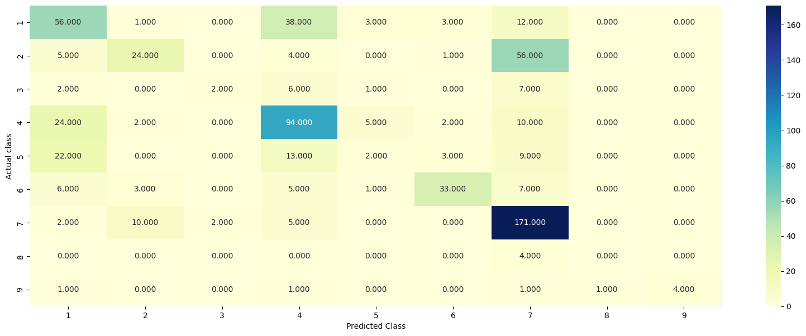

# Personalized Cancer Classification

A machine learning workflow for classifying cancer genetic mutations using gene, variation, and text features. Main analysis is in `personalized_cancer.ipynb`.

## Requirements
- Python 3.7+
- Jupyter Notebook
- pandas, numpy, matplotlib, seaborn, scikit-learn, nltk, gdown

Install with:
```bash
pip install pandas numpy matplotlib seaborn scikit-learn nltk gdown
```

## Usage
1. Run `personalized_cancer.ipynb` in Jupyter (downloads and prepares data automatically).
2. Review results and visualizations in the notebook.

## Data
- Downloads and extracts `training_variants` and `training_text` from Google Drive.

## Features
- **Gene**: Gene name
- **Variation**: Mutation type
- **Text**: Description of mutation

## Models
- Random (baseline)
- Naive Bayes
- Logistic Regression

## Evaluation
- **Log Loss** (main metric)
- **Confusion Matrix**



## Results
- **Random Model**: Log Loss ≈ 2.52
- **Naive Bayes**: Test Log Loss ≈ 1.29
- **Logistic Regression**: Best Validation Log Loss ≈ 1.23

## License
Educational and research use only. 